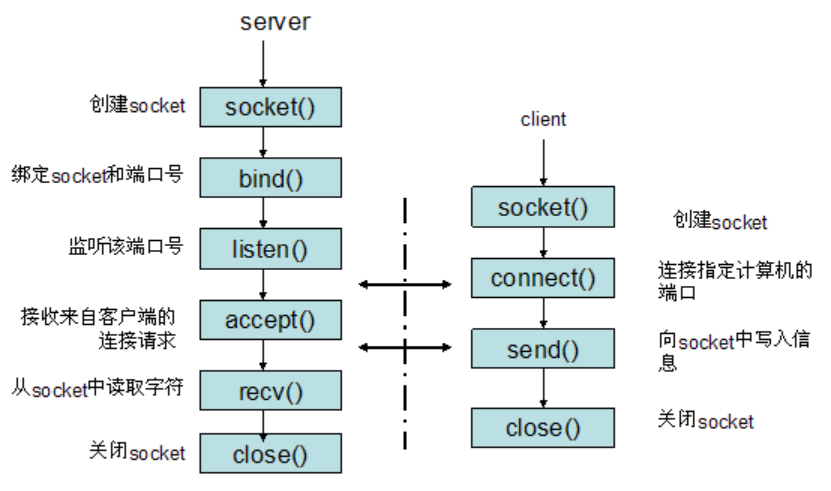
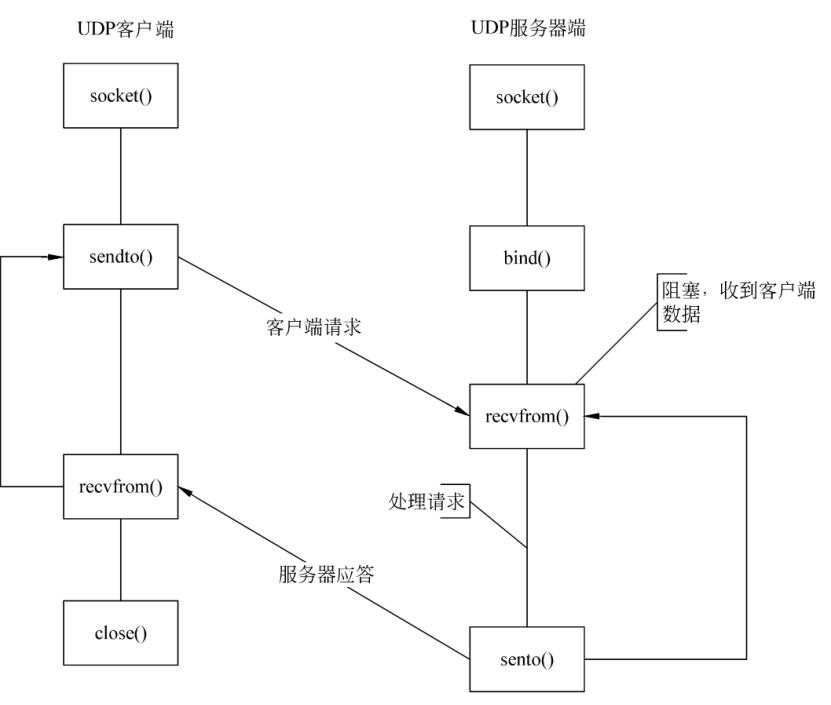

# C++面试高频题

### 1. TCP三次握手与四次挥手
+ 三次握手
    * 第一次：Client将SYN标志位置为1，随机产生一个序号seq=x，将该数据包发送给Server，Client进入SYN_SENT状态，等待Server回应
    * 第二次：Server收到数据包后根据SYN为1判断Cl6ient请求建立连接。Server将标志位SYN与ACK都置为1，ack=x+1，随机产生一个序号seq=y，将该数据包发送给Client，Server进入SYN_RCVD状态
    * 第三次：Client收到确认数据包后，检查是否ack=x+1，如果正确则将ACK置为1，ack=y+1，seq=x+1，并将该数据包发送给Server，Server收到后确认是否ACK=1，是否ack=y+1，如果正确则连接建立成功，Client和Server进入ESTABLISHED状态，三次握手结束 


+ 四次挥手
    * 第一次：Client将FIN标志位置为1，随机产生一个序号seq=u,将该数据包发送给Server，此后Client停止发送数据，Client进入FIN_WAIT_1状态
    * 第二次：Server收到数据包后根据FIN=1判断Client请求断开连接，Server将ACK=1，将ack=u+1，随机产生一个序号seq=v，发送该数据包，Server进入CLOSE_WAIT状态，等待将数据发送完；Client收到该数据包后进入CLOSE_WAIT_2状态
    * 第三次：Server将FIN=1，ACK=1，ack=u+1，随机产生一个序号seq=w，将该数据包发送给Client，Server进入LAST_ACK状态
    * 第四次：Client收到数据包后检查其中FIN，发现为1，接着将ACK=1，seq=u+1，ack=w+1，发送给数据包给Server，Client进入TIME_WAIT状态；Server收到后关闭连接，进入CLOSE状态，Client在发送给数据包后等待2MSL（报文最大生存时间）然后关闭连接，进入CLOSE状态


### 2. 挥手与握手过程中Client与Server的状态变化
+ Client：CLOSE -> SYN_SENT -> ESTABLISHED -> FIN_WAIT_1 -> FIN_WAIT_2 -> TIME_WAIT -> CLOSE
+ Server:LISTEN -> SYN_RCVD -> ESTABLISHED -> CLOSE_WAIT -> LAST_ACK -> CLOSE

### 3. 为什么三次握手、四次挥手？
+ 三次握手：三次握手可以防止已经失效的请求连接的报文突然有传输到服务器端导致服务器资源的浪费。
+ 四次挥手：由于Server收到ClientFIN报文的时候可能还有数据需要传送，因此先发送ACK报文告知Client请求收到，等待Server发送完数据，就可以像Client发送FIN报文告知数据发送完毕

### 4. TCP的滑动窗口、流量控制和拥塞控制，快重传和快恢复，超时重传
+ 滑动窗口协议
    * 窗口：发送者可以连续发送一段字节序列而不需等待接受者的应答，这段连续序列的长度称为窗口
    * 滑动：窗口的大小是可以随着发送的过程而变化的

+ 流量控制：主要是接收方传递消息给发送方，使其不要发送数据太快。具体实现为应答的ACK包中会包含自己的接收窗口的大小，利用窗口的大小控制发送方数据的发送速度

+ 拥塞控制：防止过多的数据注入到网络中导致路由器或链路过载。具体实现的方法为：（1）慢启动、拥塞控制；（2）快重传、快恢复
    * 慢启动：定义拥塞窗口，初始大小为1，之后每次收到确认应答，将拥塞窗口的大小*2
    * 拥塞避免：设置慢启动阈值，一般为65535,，当拥塞窗口大于这个阈值后，每次收到确认应答将拥塞窗口的大小+1
    * 快重传：如果接收方发现某个包丢失，会对发送方发送重传请求；一旦发送方收到三个一样的ack，立即重传该包；随后快恢复
    * 快恢复：首先将慢启动阈值设置为当前拥塞窗口的1/2；然后将拥塞窗口重新设置为慢启动阈值大小+3
    
### 5.OSI七层模型和TCP/IP四层模型
+ OSI七层模型
    * 物理层：主要协议IEEE802.3、RJ45等
    * 数据链路层：主要协议MAC、VLAN等
    * 网络层：主要协议为IP、ARP、ICMP、IGMP等
    * 传输层：主要协议为TCP、UDP等
    * 会话层：主要协议为RPC等
    * 表示层：主要协议为JPEG等
    * 应用层：主要协议为FTP、HTTP、DNS等

+ TCP/IP四层模型
    * 网络接口层：MAC、VLAN等
    * 网络层：IP、ARP、ICMP、IGMP等
    * 传输层：TCP、UDP等
    * 应用层：HTTP、DNS、SMTP

### 6. TCP与UDP的区别
+ TCP是面向连接的、可靠的，而UDP是非面向连接、不可靠的
+ TCP一对一，UDP支持一对一，一对多，多对一，多对多
+ TCP具有拥塞控制与流量控制而UDP没有
+ TCP报文长度动态改变而UDP不是
+ TCP传输单位为报文段，而UDP传输单位为用户数据报
+ TCP注重安全性，而UDP数据传输快
+ 用TCP的协议：FTP、Telnet、SMTP、POP3、HTTP(s)，用UDP的协议：DNS、SNMP、TFTP

### 7. HTTP与HTTPS的区别
+ 区别如下：
    1. HTTP协议传输的数据是以明文方式，而HTTPS协议传输的数据则是经过TLS加密的
    2. HTTPS在TCP三次握手后，还需要进行SSL的handshake，协商加密密钥
    3. HTTPS需要在服务器端申请证书，浏览器端安装对应的根证书
    4. HTTP协议的端口是80，HTTPS协议的端口是443

+ HTTPS优缺点
    * 优点
        - 安全性更高
        - 可以认证用户和服务器，确保数据发送到正确的用户和服务器
    * 缺点
        - 握手阶段延时较高
        - 部署成本高（购买证书，解密吃CPU）

### 8.浏览器中输入URL后会发生什么
1. 域名解析获得IP地址：用到DNS、UDP协议
2. 建立http连接：用到http协议
3. 生成get请求报文：生成后交给TCP层处理，用到TCP与IP协议

### 9. HTTP请求步骤
1. 客户端连接到web服务器
2. 发送http客户请求
3. 服务器接受请求并返回http响应
4. 释放TCP连接
5. 客户端浏览器解析html内容

### 10. socket编程中服务器端和客户端主要用到哪些函数
+ 基于TCP的socket
    * Server
        1. 创建socket：socket()
        2. 设置socket属性：setsockopt()
        3. 绑定IP、端口号：bind()
        4. 设置允许的最大连接数：listen()
        5. 接收客户端的连接：accept()
        6. 收发数据：send()+recv() or read()+write()
        7. 关闭网络连接：close()
        8. 关闭监听
    * Client
        1. 创建socket：socket()
        2. 设置socket属性：setsockopt()
        3. 设置绑定IP、端口号：bind()
        4. 设置要连接的IP及端口
        4. 连接Server：connect()
        5. 收发数据: send()+recv() / read()/write()
        6. 关闭网络：close()


+ UDP的socket
    * Server
        1. 创建socket：socket()
        2. 设置属性：setsockopt()
        3. 绑定IP、端口：bind()
        4. 循环收、发数据：recvfrom() + sendto()
        5. 关闭连接
    * Client
        1. 创建socket：socket()
        2. 设置属性：setsockopt()
        3. 绑定IP、端口：bind()
        4. 设置要连接的IP及端口
        5. 发送、接收数据：sendto() + recvfrom()
        6. 关闭连接


### Post与Get的区别

### HTTP请求头部
+ 请求行
    * 请求方法
    * 请求URL
    * HTTP协议及版本
+ 报文头
+ 报文体
### 指针常量与常量指针
区别：*在前在是指针常量，const在前则是常量指针

+ 指针常量：不能改变指针的指向，int* const p = &a;
+ 常量指针：不能改变指针指向的值， const int *p;

### C++内存布局（从高到低的顺序）以及为什么这么布局？
+ 内核空间（1G）
+ 栈（向下增长）：局部变量
+ 内存映射段：存放静态库、动态库以及文件映射等
+ 堆（向上增长）：malloc、calloc、realloc以及new申请的空间
+ 数据段
    * BSS段：未初始化或初始化为0的全局变量和静态变量
    * 数据段：已初始化的全局变量和静态变量
+ 代码段
    * 可执行代码
    * 只读常量

### 为什么构造函数不可以是虚函数？
+ 构造函数不需要是虚函数，也不允许是虚函数。因为当创建一个对象时，我们总是要明确指定对象的类型，尽管我们可能通过基类的指针或引用去访问它。
+ 从实现的角度看。虚函数表总是在构造函数调用之后才建立，因而构造函数不可能成为虚函数。


### 红黑树的特点
1. 每个节点要么是红的，要么是黑的；
2. 根节点是黑的；
3. 每个叶节点都是黑的；
4. 如果一个节点是红的，那么它的两个子节点都是黑的；
5. 对于任意一个节点而言，其到叶节点尾端NULL指针的每条路径都经过相同数目的黑节点。

### AVL树和红黑树的定义与区别
+ AVL树：AVL（平衡二叉树），是一种特殊的排序二叉树，其左右子树也是平衡二叉树，且左右子树高度差的绝对值不大于1。
+ 红黑树：红黑树是一种二叉查找树，但在每个节点增加了一个存储位表示节点的颜色，非红即黑。通过对任何一条根到叶子的路径上各个节点着色的方式的限制，红黑树确保没有一条路径会比其他路径长2倍。故，红黑树是一种弱平衡二叉树。红黑树有以下5个特点：
    1. 每个节点要么是红的，要么是黑的；
    2. 根节点是黑的；
    3. 每个叶节点都是黑的；
    4. 如果一个节点是红的，那么它的两个子节点都是黑的；
    5. 对于任意一个节点而言，其到叶节点尾端NULL指针的每条路径都经过相同数目的黑节点。
+ 区别：AVL树是高度平衡的，频繁的插入和删除，会引起频繁的rebalance，导致效率下降；红黑树不是高度平衡的，算是一种折中，插入最多2次旋转，删除最多3次旋转。

### B-树与B+树的定义
+ B树：一颗m阶B树定义如下
    * 每个节点最多有m-1个关键字
    * 根节点最少可以只有1个关键字
    * 非根节点至少有ceil(m/2)+1个关键字
    * 每个节点的关键字都按从小到大的顺序排列，左子树的关键字都小于它，右子树的关键字都大于它
    * 所有叶子节点都位于同一层（或者说根节点到每个叶子节点的长度相同）
+ B+树：一颗m阶B+树的定义如下
    * B+树的定义基本与B树等价，但是B+树还有以下要求
    * B+树包含2种类型的节点：内部节点（索引节点）和叶子节点。
    * 内部节点不保存数据，只用于索引，因而所有的数据都保存在叶子节点上
    * 内部节点中的key都按从小到大的顺序排列，对于内部节点中的一个key，左子树中所有的key都*小于*它，右子树中的key都*大于等于*它
    * 每个叶子节点都存有下一个相邻叶子节点的指针，叶子节点本身根据关键字从小到大形成链表

### 堆与栈的区别
+ 堆是有低地址向高地址扩展，而栈是高地址向低地址扩展
+ 堆中的内存需要手动的申请与释放，而栈中的地址是由OS自动的申请和释放的
+ 堆中频繁的调用malloc和free会产生内存碎片，而栈不会
+ 堆的分配效率低，而栈的分配效率高

### 常见排序算法总结

算法|平均时间复杂度|最好时间复杂度|最坏时间复杂度|空间复杂度|是否稳定
--|:--:|:--:|:--:|:--:|--:
插入排序|O(n^2)|O(n)|O(n^2)|O(1)|稳定
冒泡排序|O(n^2)|O(n)|O(n^2)|O(1)|稳定
简单选择排序|O(n^2)|O(n^2)|O(n^2)|O(1)|不稳定
希尔排序|O(n^1.25)|O(n)|O(n^2)|O(1)|不稳定
归并排序|O(nlogn)|O(nlogn)|O(nlogn)|O(n)|稳定
快速排序|O(nlogn)|O(nlogn)|O(n^2)|O(nlogn)|不稳定
堆排序|O(nlogn)|O(nlogn)|O(nlogn)|O(1)|不稳定

### 常用设计模式
+ 单例模式：主要解决全局使用的类频繁的创建和销毁的问题。单例模式下可以确保一个类只有一个实例，而且自行化实例并向整个系统提供这个实例。
    * 多线程安全问题
        - 饿汉式：基于class loader机制避免多线程同步问题，但可能
        - 懒汉式：通过双重锁机制实现线程安全

+ 工厂模式：主要解决接口选择的问题。该模式下定义一个创建对象的接口，让其子类自己决定实例化哪一个工厂类，使其创建过程延迟到子类进行

+ 观察者模式：定义对象间的一种一对多的依赖关系。当被观察者发生状态改变时，观察者会受到通知。类似于回调函数。

+ 装饰器模式：对已经存在的某些类进行装饰，以拓展一些功能，从而动态的为一个对象增加新的功能。

### OOP设计模式五大原则
+ 单一职责：避免相同的职责分配到不同的类中；避免一个类承担太多职责
+ 接口隔离：客户端不应实现一些它们不会使用的接口
+ 开放-封闭：在扩展性方面是开放的而在更改性方面是封闭的
+ 替换：子类型必须能替换掉它们的父类、并且出现在父类出现的任何地方
+ 依赖倒置：上层模块不应该依赖于下层模块

### 手写Singleton模式
```
template<typename T> 
class Singleton {
public:
    Singleton(const Singleton& ) = delete;
    Singleton& operator=(const Singleton& ) = delete;
    static T* getInstance() {
        pthread_mutex_lock(&mutex);
        if (uniqueInstance == nullptr) {
            uniqueInstance = new T();
        }
        pthread_mutex_unlock(&mutex);
        return uniqueInstance;
    }
private:
    static T* uniqueInstance;
    static pthread_mutex_t mutex;
    Singleton() {}
};

template<typename T> 
pthread_mutex_t Singleton<T>::mutex = PTHREAD_MUTEX_INITIALIZER;

template<typename T> 
T* Singleton<T>::uniqueInstance = nullptr;
```